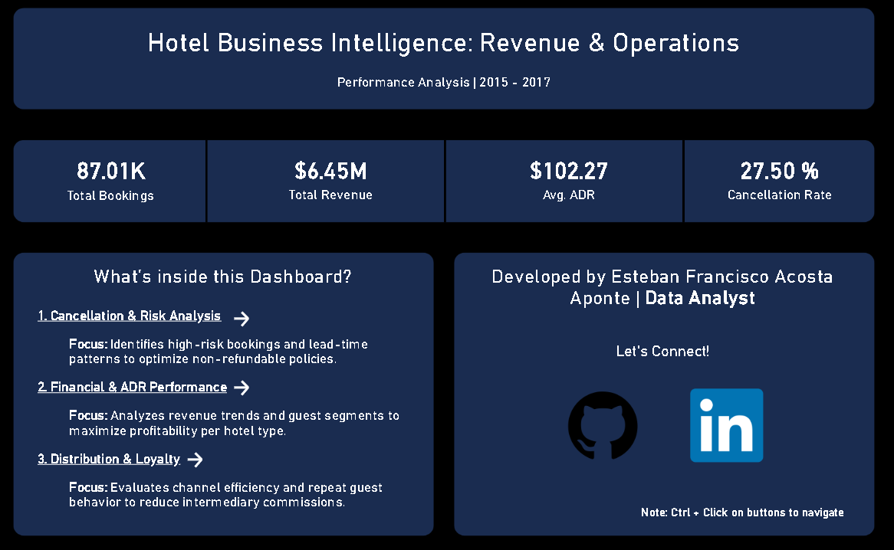

# Hotel Business Intelligence: Revenue & Loyalty Analysis

<div align="center">


</div>

## Project Overview
This project performs a deep dive into the operations of two distinct hotel types (**City Hotel** and **Resort Hotel**) using advanced **Business Intelligence** techniques. The goal is to identify cancellation patterns, optimize profitability per guest segment, and evaluate the effectiveness of distribution channels to maximize net profit margins.

The workflow covers the entire data lifecycle: from raw data ingestion and cleaning in **Python** to complex querying in **SQL** and final interactive visualization in **Power BI**.



---

## Repository Structure

```bash
├── analysis/                      # Thematic analysis notebooks
│   ├── 01_cancellation_analysis.ipynb
│   ├── 02_financial_adr_analysis.ipynb
│   └── 03_distribution_and_loyalty_analysis.ipynb
├── dashboard/                     # Interactive visualization files
│   └── Hotel_Performance_Distribution_Analysis_2015-2017.pbix
├── data/                          # Dataset management
│   ├── processed/                 # Clean data ready for analysis
│   └── raw/                       # Original unmodified data
├── data_preparation/              # ETL and preprocessing pipeline
│   └── 01_data_cleaning_and_preprocessing.ipynb
├── images/                        # Key visualization exports
└── README.md                      # Project documentation
```
---

## Data Cleaning & Preparation

To ensure the reliability of the financial insights and analytical depth, the following pipeline was implemented:

* **Deduplication:** Removed identical records to avoid overcounting bookings and revenue (crucial since the dataset lacks a primary key/ID).
* **Business Logic Filtering:** Excluded entries with 0 adults to maintain data integrity regarding actual hotel occupancy standards.
* **Handling Missing Values:** Null values in `agent` and `company` were treated as direct bookings (set to 0), and missing `country` data was labeled as "Not provided".
* **Data Typing:** Standardized numerical columns (`agent`, `children`, `company`) to integers for optimized memory usage and cleaner joins.
* **Feature Engineering:** Extracted semantic time dimensions (`arrival_month`, `arrival_day`) from date objects to enable intuitive seasonal trend analysis and chronological sorting.

---

## Key Insights & Business Analysis

### 1️⃣ Cancellation Analysis (Lead Time Correlation)
* **Insight**: Reservations made more than 90 days in advance show a high cancellation rate of **36.84%**.
* **Strategy**: Implement non-refundable rates for booking windows exceeding 30 days to stabilize projected occupancy and mitigate revenue loss.

### 2️⃣ Profitability by Guest Composition
* **Insight**: Families pay an average ADR of **$150.82**, which is **54.98% higher** than adults-only groups ($97.31).
* **Strategy**: Prioritize infrastructure investments (e.g., Kids Clubs) and targeted family marketing to maximize high-margin room nights.

### 3️⃣ Seasonality & Price Volatility
* **Insight**: The Resort's ADR drops by **73%** from its August peak ($182.10) to its November low ($48.96).
* **Strategy**: Design aggressive Q4 corporate retreat packages or "off-season" local events to bridge the revenue gap during low-demand months.

### 4️⃣ Loyalty & Distribution Efficiency
* **Insight**: Only **27.21%** of loyal/repeated guests book through direct hotel channels.
* **Strategy**: Launch a dedicated loyalty program offering exclusive direct-booking perks to convert agency-reliant guests into high-margin direct advocates.

---

## Analysis & Dashboard Access

While the interactive dashboard is hosted on an institutional account with restricted public access, you can explore the full end-to-end analysis through the following resources:

1. **In-Depth Analysis Notebooks**: 
   Head over to the `analysis/` folder to explore how the cleaned data was transformed into strategic business intelligence. These notebooks document the SQL and Python logic used to derive key insights, validated by high-resolution visual previews of the final dashboard.
2. **Local Dashboard Exploration**:
   You can download the `Hotel_Performance_Distribution_Analysis_2015-2017.pbix` file from the `dashboard/` folder and open it using **Power BI Desktop**.

---

## Tools & Technologies

* **SQL (PostgreSQL)**: Advanced data processing using CTEs, Window Functions, and query optimization.
* **Python (Pandas)**: Efficient data cleaning, normalization, and ETL processing.
* **Power BI**: End-to-end development of interactive dashboards for KPI monitoring and financial reporting.
* **Business Strategy**: Translating complex data into actionable recommendations for revenue management.

## How to Use This Repository

1.  **Clone** the repository to your local machine:
2.  **Install dependencies** (ensure you have Python installed):
    ```bash
    pip install -r requirements.txt
    ```
4.  **ETL Process**: Run the **cleaning notebook** located in `data_preparation/` to transform raw data into the `data/processed/` format.
5.  **Analysis**: Explore the thematic notebooks within the `analysis/` folder to see the SQL and Python logic.
6.  **Interactive Dashboard**: Open the `.pbix` file in the `dashboard/` folder using **Power BI Desktop** to interact with the final visualizations.

---

<div align="center">

### Let's Connect!

**Esteban Francisco Acosta Aponte**
*Data Analyst focused on business strategy and actionable insights.*

[](https://www.linkedin.com/in/esteban-data)
[](mailto:estebanacosta248@gmail.com)

</div>